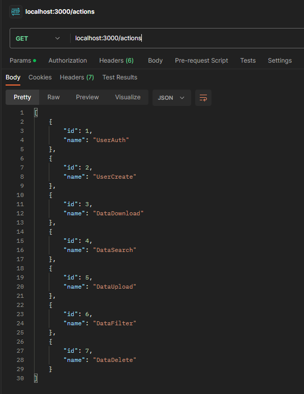
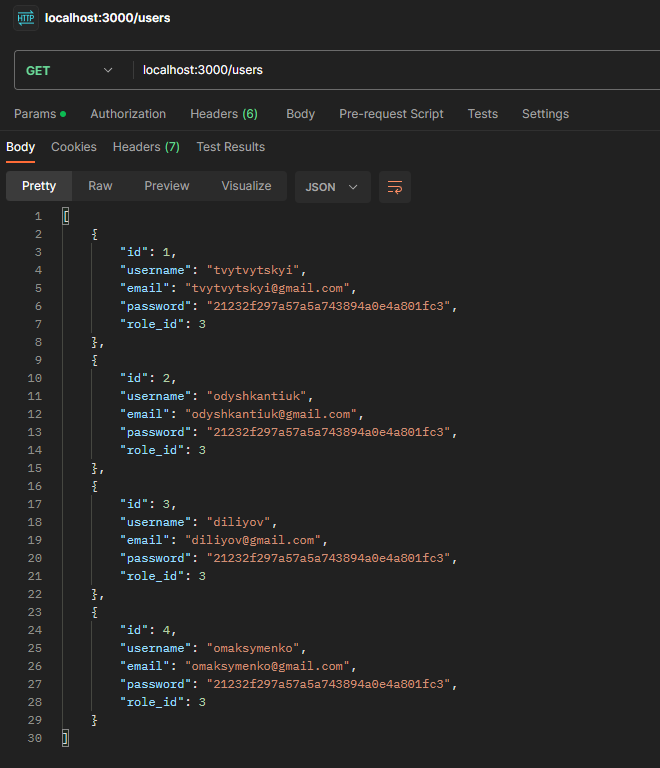
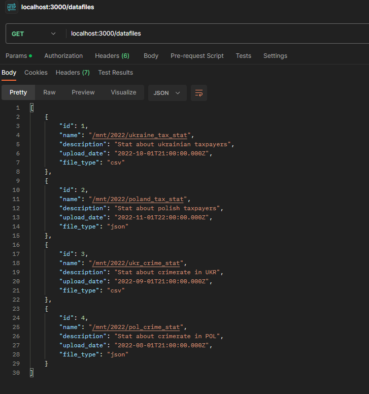
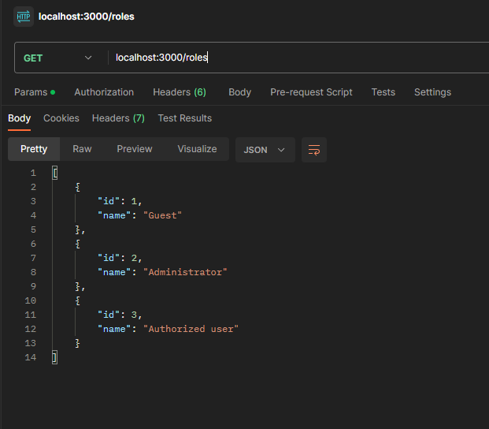
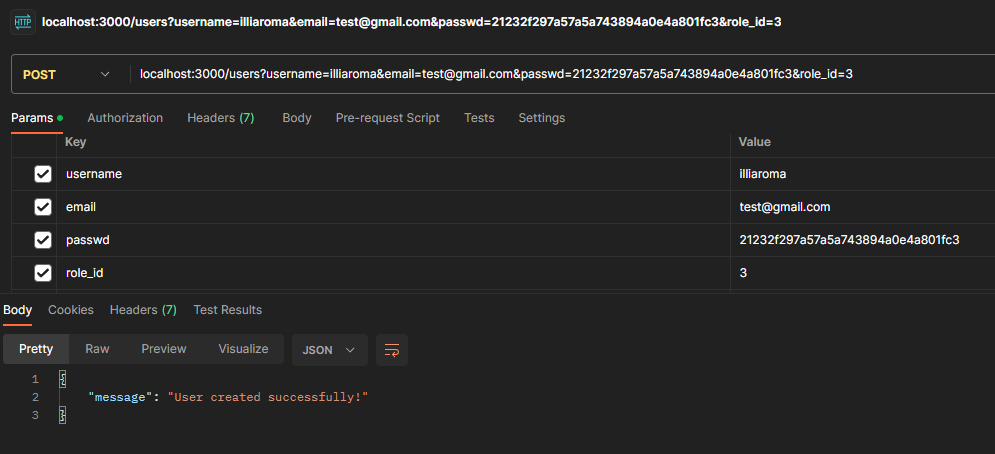
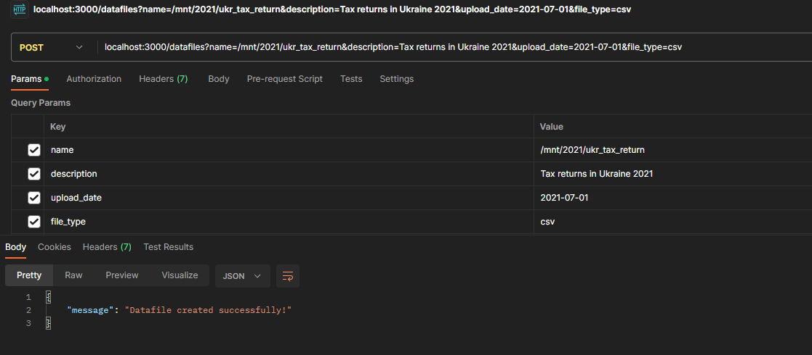
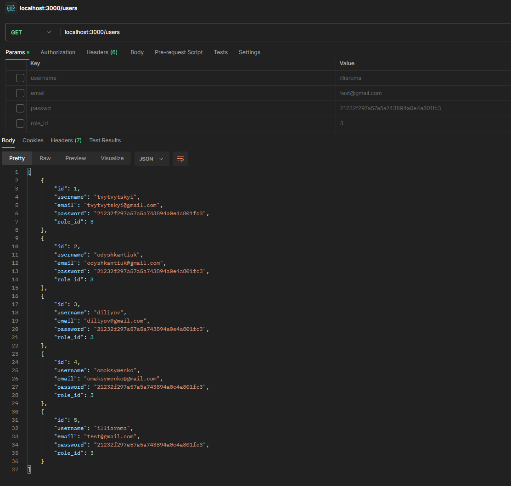
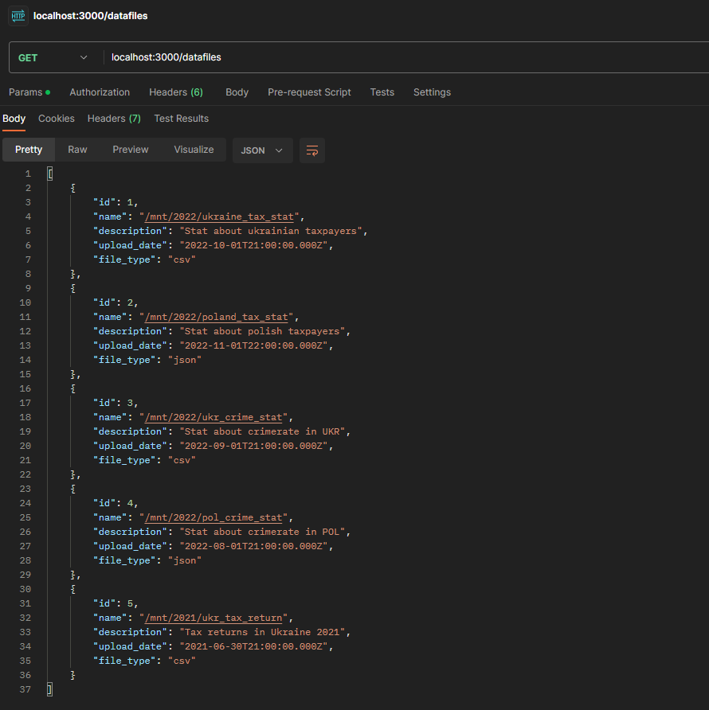
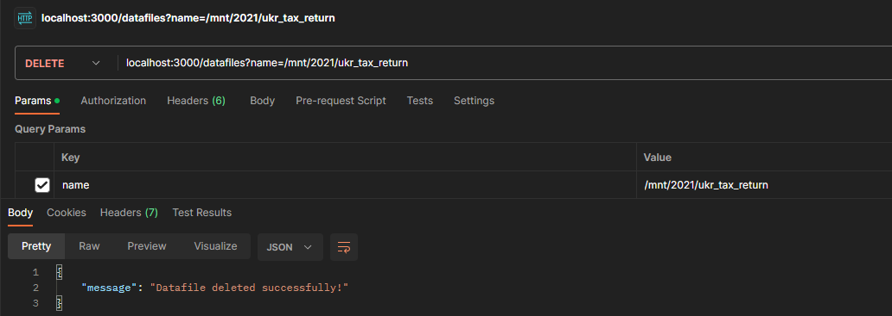
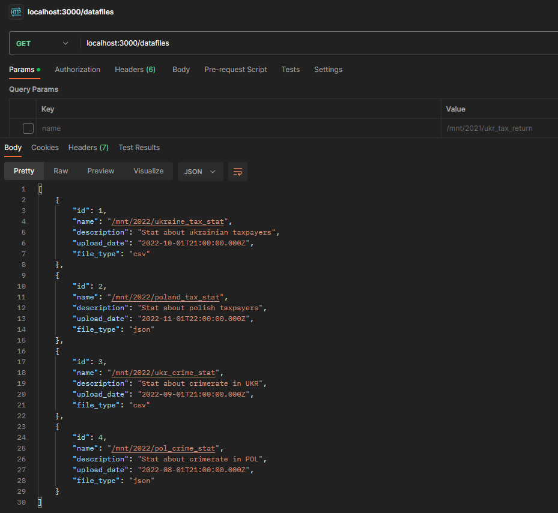

# Тестування працездатності системи

## Взаємодія з RESTful сервером запитами HTTP

*Вхідні дані згенеровані mySQL скриптом*

*Відсилання запитів HTTP на INSERT до таблиць*

*Результат відсилання запитів HTTP до INSERT до таблиць*

*Відсилання запитів HTTP на DELETE до таблиць*

*Результат відсилання запитів HTTP до DELETE до таблиць*

