# Тестування працездатності системи

## Взаємодія з RESTful сервером запитами HTTP

### *Вхідні дані згенеровані mySQL скриптом*

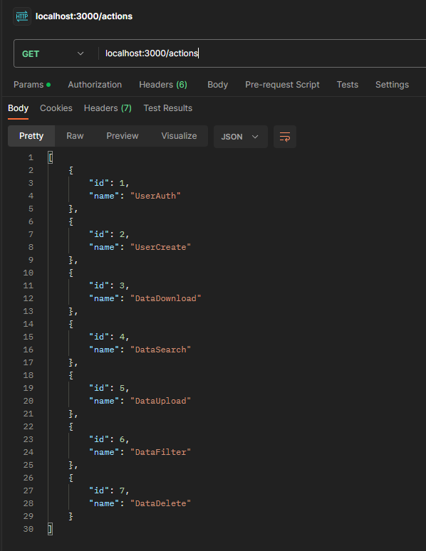
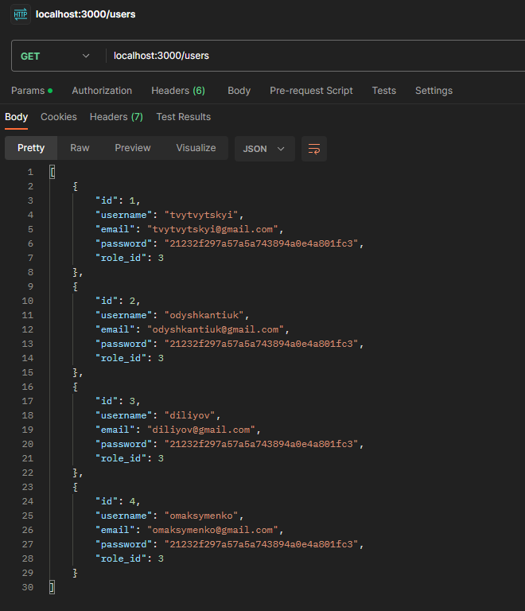
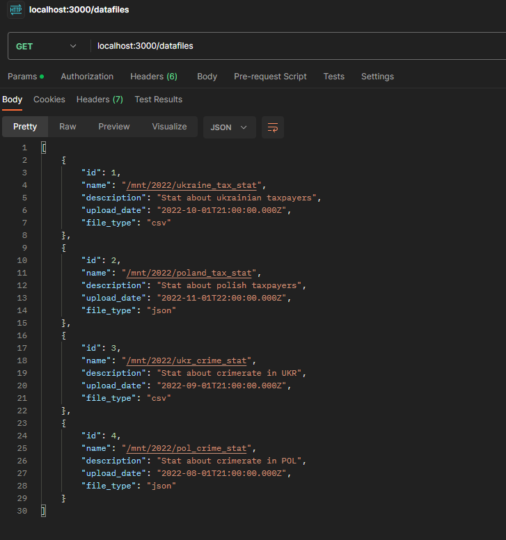
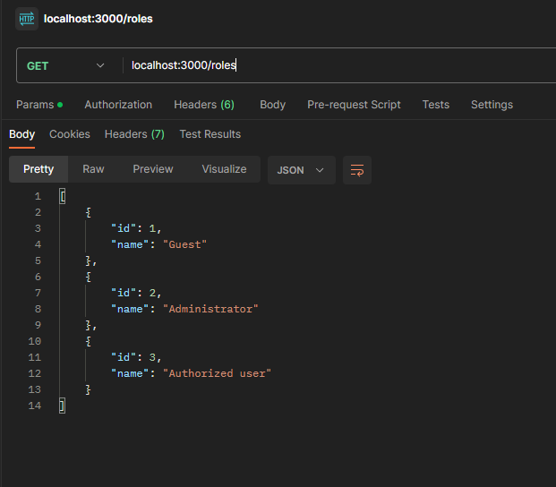

### *Відсилання запитів HTTP на INSERT до таблиць*

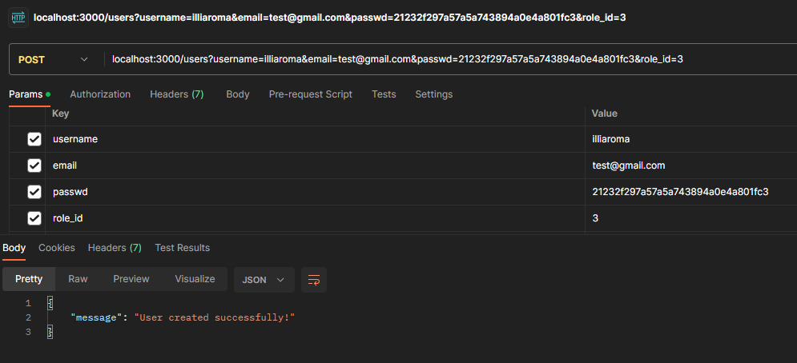
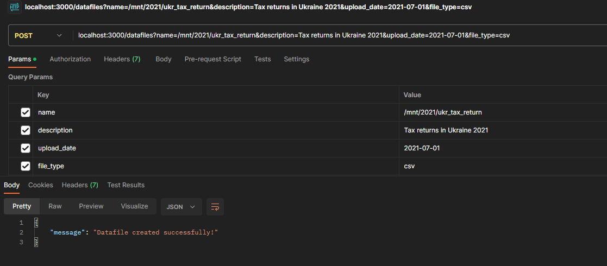

### *Результат відсилання запитів HTTP до INSERT до таблиць*

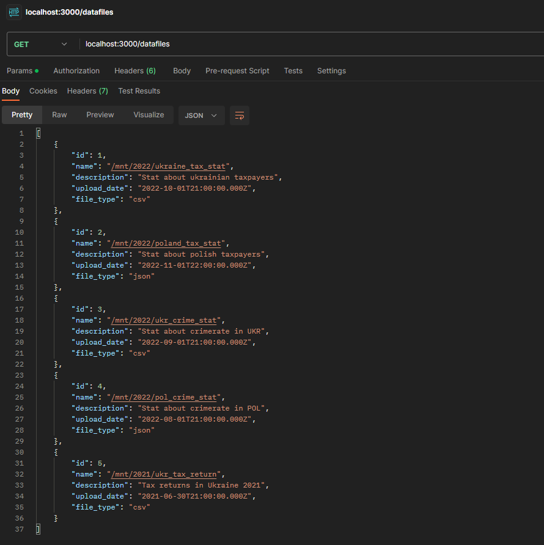

### *Відсилання запитів HTTP на DELETE до таблиць*

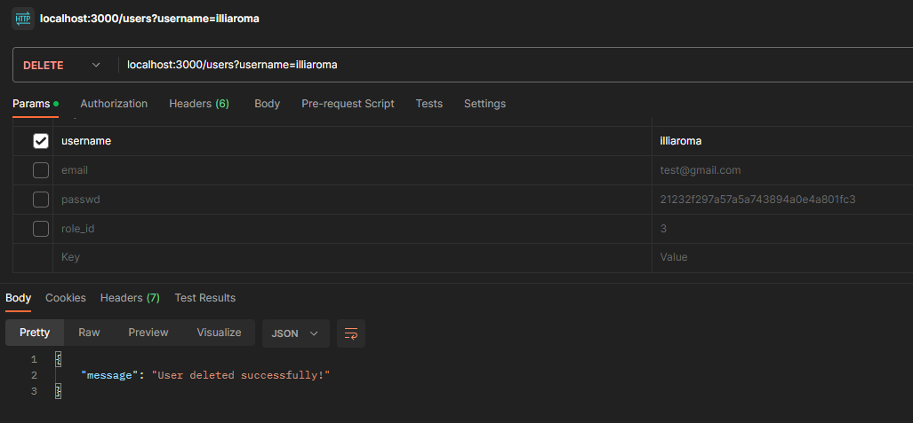
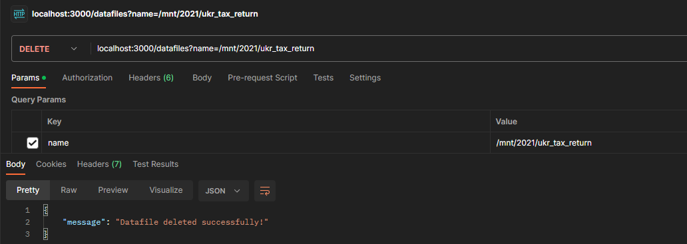

### *Результат відсилання запитів HTTP до DELETE до таблиць*

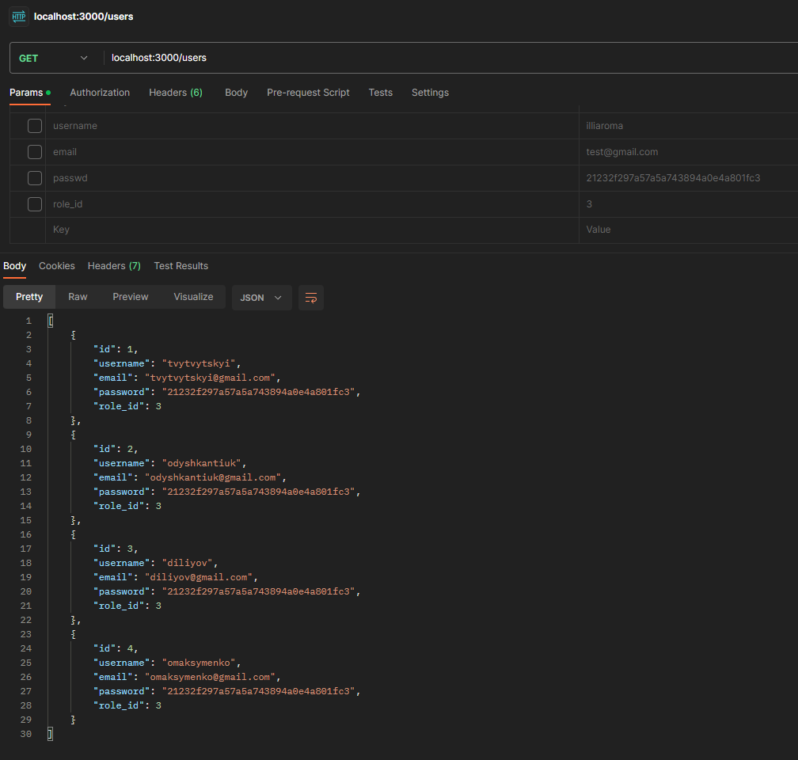
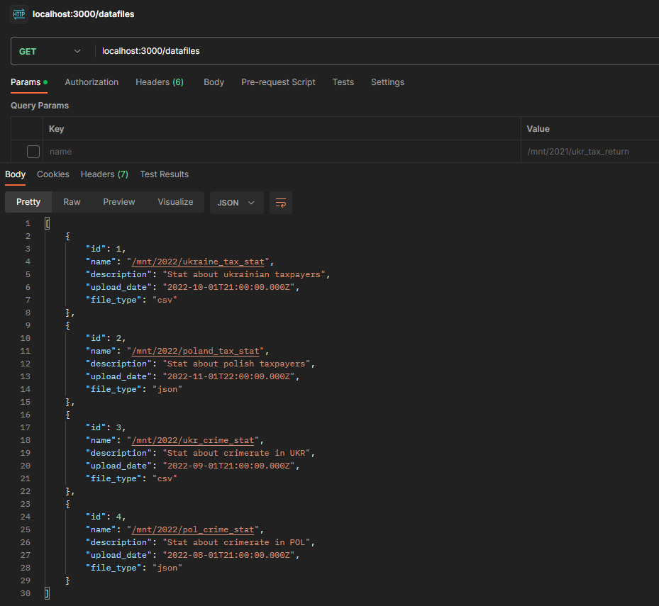
